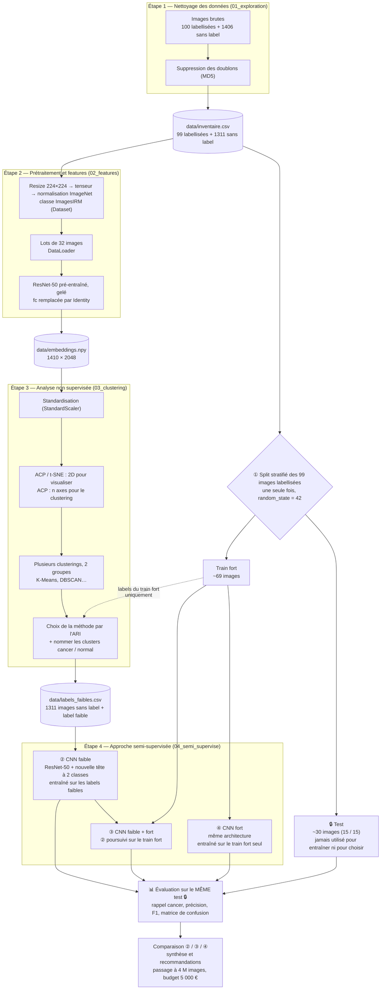

```mermaid
%%{init: {"themeVariables": {"fontFamily": "Arial, sans-serif"}, "flowchart": {"htmlLabels": false}}}%%
flowchart TD
    subgraph E1["Étape 1 — Nettoyage des données (01_exploration)"]
        A["Images brutes<br/>100 labellisées + 1406 sans label"] --> B["Suppression des doublons (MD5)"]
    end
    B --> INV[("data/inventaire.csv<br/>99 labellisées + 1311 sans label")]

    INV --> SPLIT{"① Split stratifié des 99 images labellisées<br/>une seule fois, random_state = 42"}
    SPLIT --> TRF["Train fort<br/>~69 images"]
    SPLIT --> TEST["🔒 Test<br/>~30 images (15 / 15)<br/>jamais utilisé pour entraîner ni pour choisir"]

    subgraph E2["Étape 2 — Prétraitement et features (02_features)"]
        P["Resize 224×224 → tenseur → normalisation ImageNet<br/>classe ImagesIRM (Dataset)"] --> L["Lots de 32 images<br/>DataLoader"]
        L --> R["ResNet-50 pré-entraîné, gelé<br/>fc remplacée par Identity"]
    end
    INV --> P
    R --> EMB[("data/embeddings.npy<br/>1410 × 2048")]

    subgraph E3["Étape 3 — Analyse non supervisée (03_clustering)"]
        S["Standardisation (StandardScaler)"] --> ACP["ACP / t-SNE : 2D pour visualiser<br/>ACP : n axes pour le clustering"]
        ACP --> CL["Plusieurs clusterings, 2 groupes<br/>K-Means, DBSCAN…"]
        CL --> ARI["Choix de la méthode par l'ARI<br/>+ nommer les clusters cancer / normal"]
    end
    EMB --> S
    TRF -. "labels du train fort uniquement" .-> ARI
    ARI --> LF[("data/labels_faibles.csv<br/>1311 images sans label + label faible")]

    subgraph E4["Étape 4 — Approche semi-supervisée (04_semi_supervise)"]
        M2["② CNN faible<br/>ResNet-50 + nouvelle tête à 2 classes<br/>entraîné sur les labels faibles"] --> M3["③ CNN faible + fort<br/>② poursuivi sur le train fort"]
        M4["④ CNN fort<br/>même architecture<br/>entraîné sur le train fort seul"]
    end
    LF --> M2
    TRF --> M3
    TRF --> M4

    M2 --> EV["📊 Évaluation sur le MÊME test 🔒<br/>rappel cancer, précision, F1, matrice de confusion"]
    M3 --> EV
    M4 --> EV
    TEST --> EV
    EV --> CMP["Comparaison ② / ③ / ④<br/>synthèse et recommandations<br/>passage à 4 M images, budget 5 000 €"]
```
