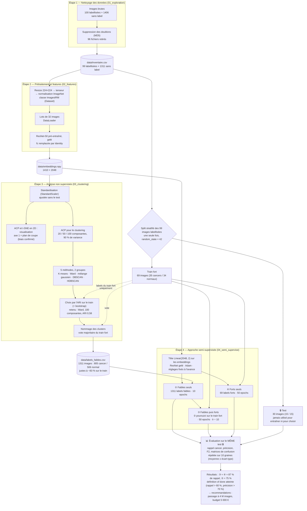

```mermaid
%%{init: {"themeVariables": {"fontFamily": "Arial, sans-serif"}, "flowchart": {"htmlLabels": false}}}%%
flowchart TD
    subgraph E1["Étape 1 — Nettoyage des données (01_exploration)"]
        A["Images brutes<br/>100 labellisées + 1406 sans label"] --> B["Suppression des doublons (MD5)<br/>96 fichiers retirés"]
    end
    B --> INV[("data/inventaire.csv<br/>99 labellisées + 1311 sans label")]

    INV --> SPLIT{"Split stratifié des 99 images labellisées<br/>une seule fois, random_state = 42"}
    SPLIT --> TRF["Train fort<br/>69 images (35 cancers / 34 normaux)"]
    SPLIT --> TEST["🔒 Test<br/>30 images (15 / 15)<br/>jamais utilisé pour entraîner ni pour choisir"]

    subgraph E2["Étape 2 — Prétraitement et features (02_features)"]
        P["Resize 224×224 → tenseur → normalisation ImageNet<br/>classe ImagesIRM (Dataset)"] --> L["Lots de 32 images<br/>DataLoader"]
        L --> R["ResNet-50 pré-entraîné, gelé<br/>fc remplacée par Identity"]
    end
    INV --> P
    R --> EMB[("data/embeddings.npy<br/>1410 × 2048")]

    subgraph E3["Étape 3 — Analyse non supervisée (03_clustering)"]
        S["Standardisation (StandardScaler)<br/>ajustée sans le test"] --> ACP["ACP et t-SNE en 2D : visualisation<br/>axe 1 = plan de coupe (biais confirmé)"]
        S --> NC["ACP pour le clustering<br/>20 / 50 / 100 composantes, 90 % de variance"]
        NC --> CL["5 méthodes, 2 groupes<br/>K-means · Ward · mélange gaussien · DBSCAN · HDBSCAN"]
        CL --> ARI["Choix par l'ARI sur le train (+ bootstrap)<br/>retenu : Ward, 100 composantes, ARI 0,58"]
        ARI --> VOTE["Nommage des clusters<br/>vote majoritaire du train fort"]
    end
    EMB --> S
    TRF -. "labels du train fort uniquement" .-> ARI
        TRF -. "vote" .-> VOTE
    VOTE --> LF[("data/labels_faibles.csv<br/>1311 images : 805 cancer / 506 normal<br/>justes à ~83 % sur le train")]

    subgraph E4["Étape 4 — Approche semi-supervisée (04_semi_supervise)"]
        H["Tête Linear(2048, 2) sur les embeddings<br/>ResNet gelé · Adam · réglages fixés à l'avance"]
        M2["② Faibles seuls<br/>1311 labels faibles · 10 epochs"] --> M3["③ Faibles puis forts<br/>② poursuivi sur le train fort · 50 epochs · lr ÷ 10"]
        M4["④ Forts seuls<br/>69 labels forts · 50 epochs"]
        H --> M2
        H --> M4
    end
    EMB --> H
    LF --> M2
    TRF --> M3
    TRF --> M4

    M2 --> EV["📊 Évaluation sur le MÊME test 🔒<br/>rappel cancer, précision, F2, matrices de confusion<br/>répétée sur 10 graines (moyenne ± écart-type)"]
    M3 --> EV
    M4 --> EV
    TEST --> EV
    EV --> CMP["Résultats : ③ ≈ ④ ≈ 87 % de rappel, ② ≈ 75 %<br/>definition of done atteinte (rappel > 60 %, précision > 70 %)<br/>→ recommandations : passage à 4 M images, budget 5 000 €"]
```